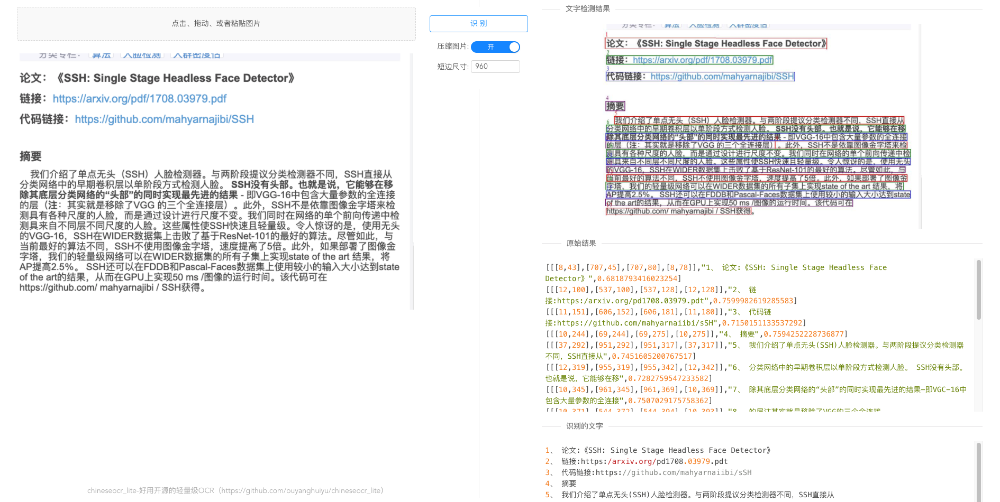

# chineseocr_lite 的 onnx 推理, 部署简单

## 原始项目分支（torch推理，ncnn推理等）：[master](https://github.com/ouyanghuiyu/chineseocr_lite/tree/master)

## 环境
- python3.6

- linux/macos/windows

## web服务启动
``` Bash
cd chineseocr_lite## 进入chineseocr目录
python backend/main.py 
```
## 以下为从Python代码翻译为各种语言的Demo，仅供参考:
* [C++ ncnn Demo](https://github.com/ouyanghuiyu/chineseocr_lite/tree/onnx/pc_projects/OcrLiteOnnxToNcnn)
* [C++ onnx Demo](https://github.com/ouyanghuiyu/chineseocr_lite/tree/onnx/pc_projects/OcrLiteOnnx)
* [Android ncnn Demo](https://github.com/ouyanghuiyu/chineseocr_lite/tree/onnx/android_projects)
* [.Net Demo](https://github.com/ouyanghuiyu/chineseocr_lite/tree/onnx/dotnet_projects)
* [Jvm Demo](https://github.com/ouyanghuiyu/chineseocr_lite/tree/onnx/jvm_projects)

## 在线体验(lite版本<模型还在训练中>，支持竖排，空格识别，文字行方向旋转)： http://ocr.timeline229.com:8089/

## 识别结果展示

<p align="center"></p>
<p align="center"></p>


## 参考
1. TrWebOCR https://github.com/alisen39/TrWebOCR         

## 接口调用示例

```python
from pprint import pprint

# Python 使用File上传文件
import requests
def ocr_img():
    # url = 'http://www.5uks.net:3000/api/tr-run/'
    url = 'http://www.5uks.net:3000/api/zh-ocr/'
    img1_file = {
        'file': open('img1.png', 'rb')
    }
    res = requests.post(url=url, data={'compress': 0}, files=img1_file)
    pprint(res.json())

# Python 使用Base64
import requests
import base64
def img_to_base64(img_path):
    with open(img_path, 'rb')as read:
        b64 = base64.b64encode(read.read())
    return b64

def ocr_base64():
    # url = 'http://www.5uks.net:3000/api/tr-run/'
    url = 'http://www.5uks.net:3000/api/zh-ocr/'
    img_b64 = img_to_base64('./img1.png')
    res = requests.post(url=url, data={'img': img_b64})
    pprint(res.json())

if __name__=="__main__":
    # ocr_img()
    ocr_base64()
```

## QQ群
994929053
